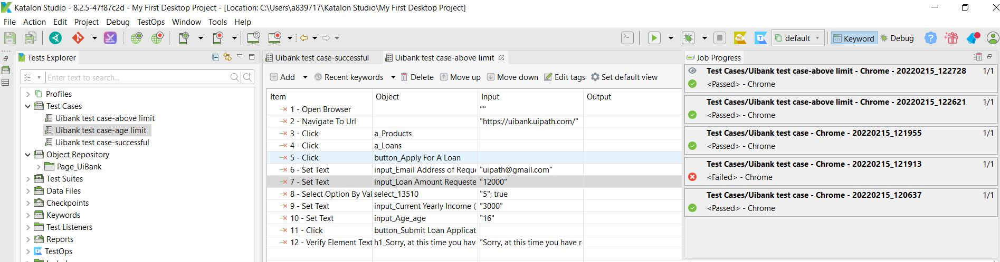

# UiBank_Test_Katalon

Katalon Studio is an integrated development environment (IDE) for automated test generation, where you can create, execute and view reports for your automated test. With both manual view and script view, Katalon Studio is suitable even when you have little programming experience, or you are aready an expert in the automated testing field.
With Katalon Studio, you can do the following:

- Web testing. See Introduction to Web Testing.
- Mobile testing for Android and iOS. See Introduction to Mobile Recorder.
- API testing. See Introduction to API Testing.
- Desktop app testing. See Introduction to Desktop App Testing.
- Data-driven testing. See Data-driven Testing with Katalon Studio.
- BDD testing. See BDD Testing Framework (Cucumber integration).

test results as the image :
